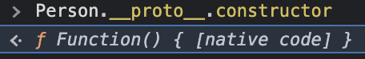
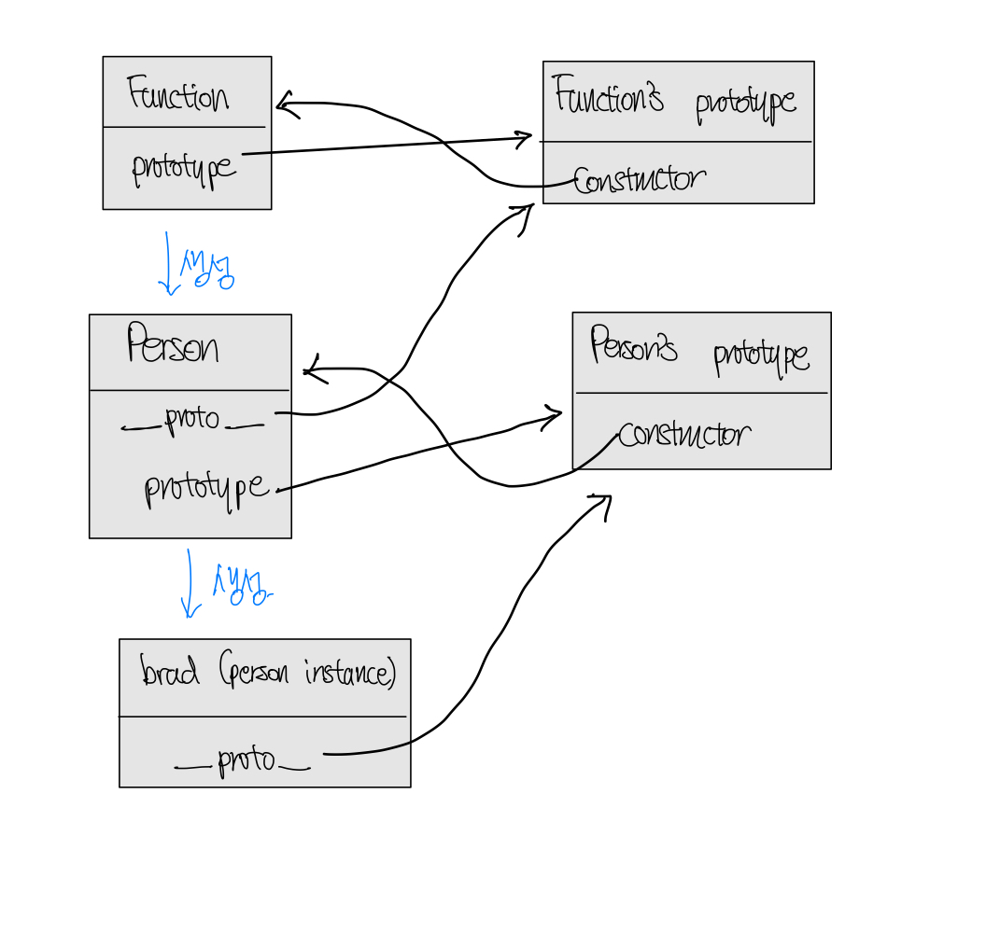
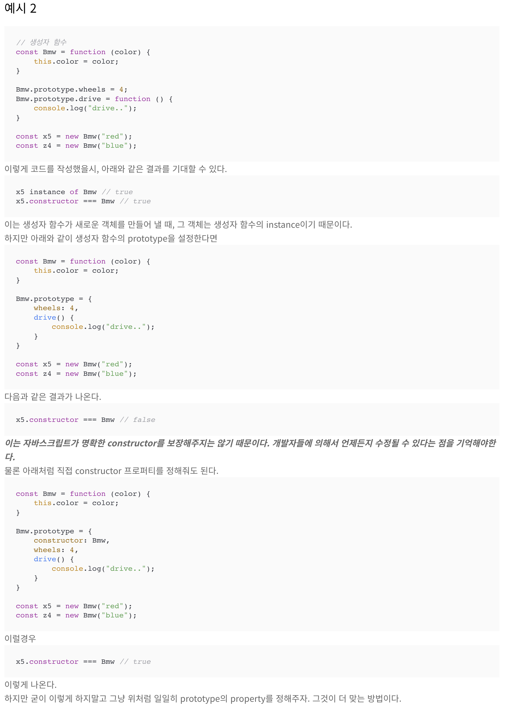
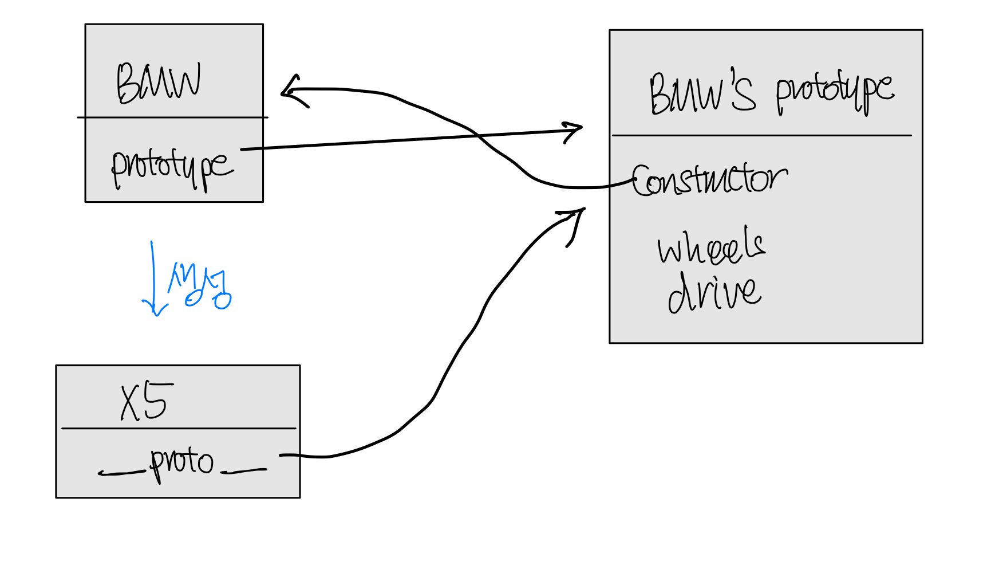

# constructor in JavaScript

[개념 - prototype](./%EA%B0%9C%EB%85%90%20-%20prototype.md)에 대해 정리/공부하던 중 `constructor`가 궁금해져 조금 더 알아보고 정리해 놓는다.

## constructor의 이해

위에서 `constructor`라는 개념이 언급되었다. 결정적으로 `constructor`는 함수이고, 특정 (위의 `Person`과 같은) 특정 Object를 만드는데 사용된다.

그래서 사실 [개념 - prototype](%EA%B0%9C%EB%85%90%20-%20prototype.md)문서의 맨위 그림을 이해했다면,

```javascript
const person = new Person("person");

const brad = new person.__proto__.constructor("brad");
const lee = new Person.prototype.constructor("brad");
```

이런식으로 constructor를 이용하여 `Person` 객체를 생성할 수 도 있다.

## constructor function

[위에서 볼수있듯이](#constructor의-이해), `constructor`는 함수이다. 이 `constructor`가 내가 항상 정의해서 사용하던 `constructor function`이었던 것이다.

자바의 `class`와 같이 자바스크립트에서는 특정 타입(?)의 object를 만들어 내기위해 아래와 같이 `constructor function`을 정의한다:

```javascript
function Person(name) {
  this.name = name;
  this.sayHello = function () {
    console.log("Hello");
  };
}
```

이렇게 정의한 `constructor function`이 우리가 정의한 `Person`이라는 타입(?)의 객체인스턴스를 만드는데 쓰이는 것이다.

여기서의 이 `constructor function`은 `Person.prototype.constructor`이랑 동일하다.

## 잠깐만, `constructor function`도 결국 `object`아냐?

맞다. [MDN web docs](https://developer.mozilla.org/en-US/docs/Web/JavaScript/Reference/Functions)에 의하면 자바스크립트의 모든 `function`들 또한 object이다. (그래서 console에 찍어보면 object처럼 나오지는 않을지라도 object처럼 `property`를 갖는다는 점은 확인할 수 있다..)

[또한, `function`(임의로 정의된 자바스크립트 함수)의 `constructor`는 `Function` 이라고 한다.](https://developer.mozilla.org/en-US/docs/Web/JavaScript/Reference/Global_Objects/Function) 이 말을 이해하기 위해선 앞으로 나올 사항들에 대한 이해와 앞서배운 `__proto__`의 개념에 대한 이해가 필요하다.

1. 자바스크립트의 모든 `function`은 `object`라고 하였다. 그렇다면 `__proto__` 속성이 존재해야한다.
2. 그 `__proto__`는 `function`을 만들어낼때 쓰는 `constructor`를 속성으로 가지고 있을 것이다.
3. 찍어보자.

<figure>

</figure>

native코드라서 더이상 자세히 들여다볼수는 없다. 하지만, 위 1,2,3번에 일치한는 결과가 찍혔다.
더 나아가서, 아래 식도 일치한다.

```javascript
Function.prototype.constructor === Person.__proto__.constructor; // true

Person.__proto__.constructor === Function; // true
```

그런데, 프로토타입 개념에 의하여 두번째 식은 중간에 `__proto__`를 생략할 수 있어 아래와 같아진다:

```javascript
Person.constructor === Function; // true
```

이는 [MDN web docs](https://developer.mozilla.org/en-US/docs/Web/JavaScript/Reference/Global_Objects/Function)에 나온 `(function () {}).constructor === Function`의 관계가 여기서도 일치함을 보여준다.

### 그림으로 보면 쉽다.

그래서, 위 사실을 그림으로 표현하면 다음과 같다:



## 그래서 이 정도까지 알아야하나?

나도 모르겠다. 이 정도까지 알아야하는지. 실무에서 아직 써먹어 본적이 없다. 근데 만약 위 내용과 관련해서 디버깅 해야할 상황이 닥친다면, 상당히 도움이 되겠지.

사실 내가 constructor에 대해 좀 더 알아보고자 한 것은, 자바스크립트를 처음 배울 때 참고했던 [코딩앙마 자바스크립트 중급강좌](https://www.youtube.com/watch?v=4_WLS9Lj6n4)에 나왔던 constructor 관련 개념에 대해 제대로 이해하고자 했기 때문이다.



위 그림은 내가 코딩앙마 강좌를 들으며 Prototype/constructor 관련해서 정리해놨던 글인데, 정리 당시에는 이해가 가지 않았었다. **_"이는 자바스크립트가 명확한 constructor를 보장해주지 않는다"_**는 말이 그때는 전혀 이해가 가지 않았는데, 이제는 이해가 간다.

첫번째 예시인

```javascript
// 생성자 함수
const Bmw = function (color) {
  this.color = color;
};

Bmw.prototype.wheels = 4;
Bmw.prototype.drive = function () {
  console.log("drive..");
};

const x5 = new Bmw("red");
const z4 = new Bmw("blue");
```

이 부분에선, 우리는 `Bmw.prototype`이라는 object에 `wheels`와 `drive`라는 property만 추가했을 뿐이다.

요런식으로 말이다:



그러니까 당연히 `x5.constructor === BMW`가 `true`이지. (참고로 `x5.constructor === x5.__proto__.constructor`)

그런데 두번째 예시처럼:

```javascript
const Bmw = function (color) {
  this.color = color;
};

Bmw.prototype = {
  wheels: 4,
  drive() {
    console.log("drive..");
  },
};

const x5 = new Bmw("red");
const z4 = new Bmw("blue");
```

이러게 `Bmw.prototype`을 **_아예 새로운 객체로 바꿔버리면!!_**, `Bmw.prototype`은 그냥 생뚱맞은 pure object가 되버리니, 위 그림의 Bmw와 Bmw's prototype간의 관계가 끊기는 것이다.

그래서 당연히

```javascript
x5.constructor === Bmw; // false
```

가 성립하지.
