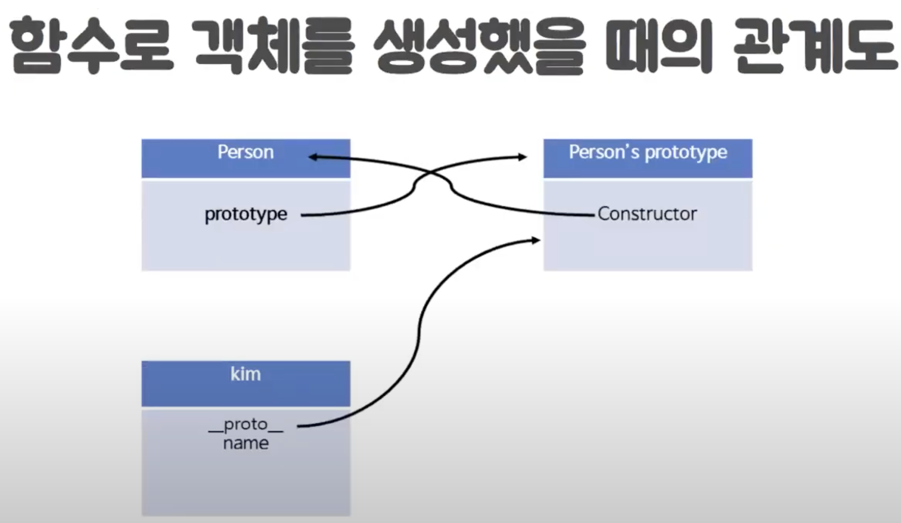
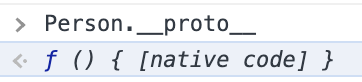
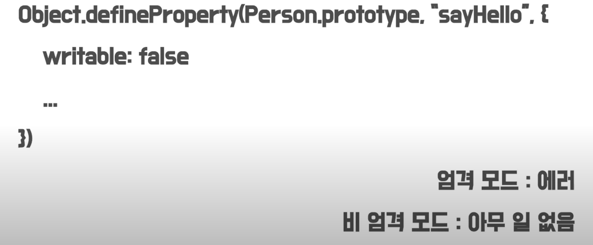
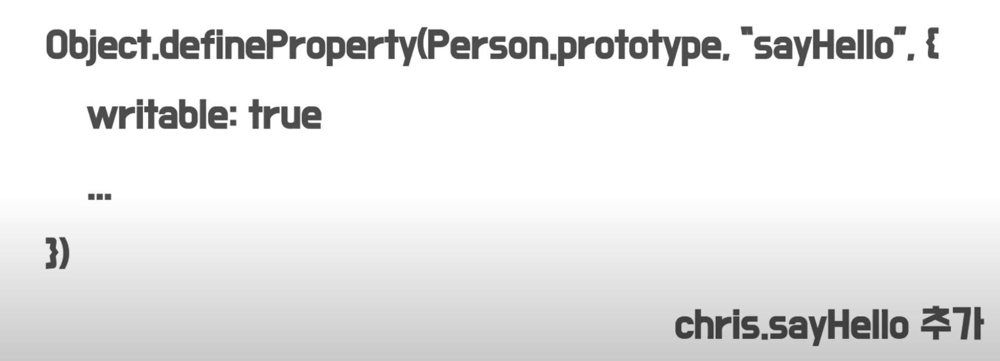
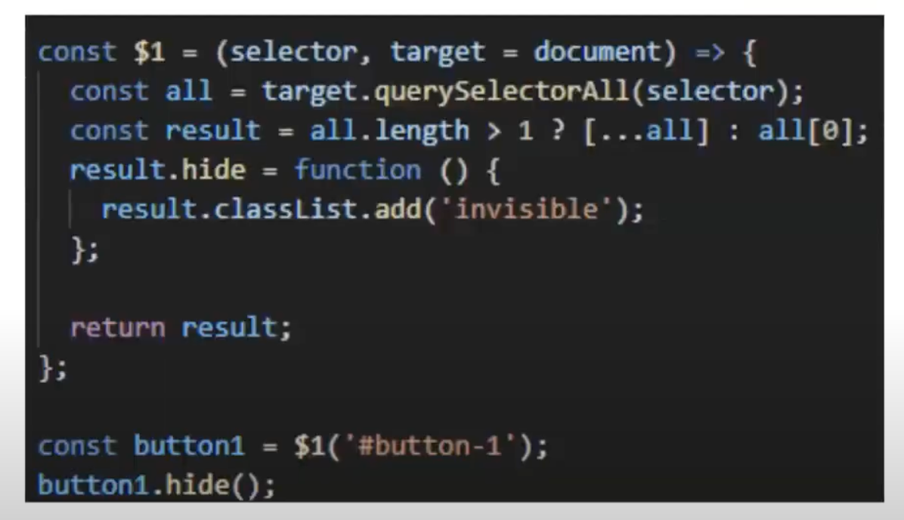
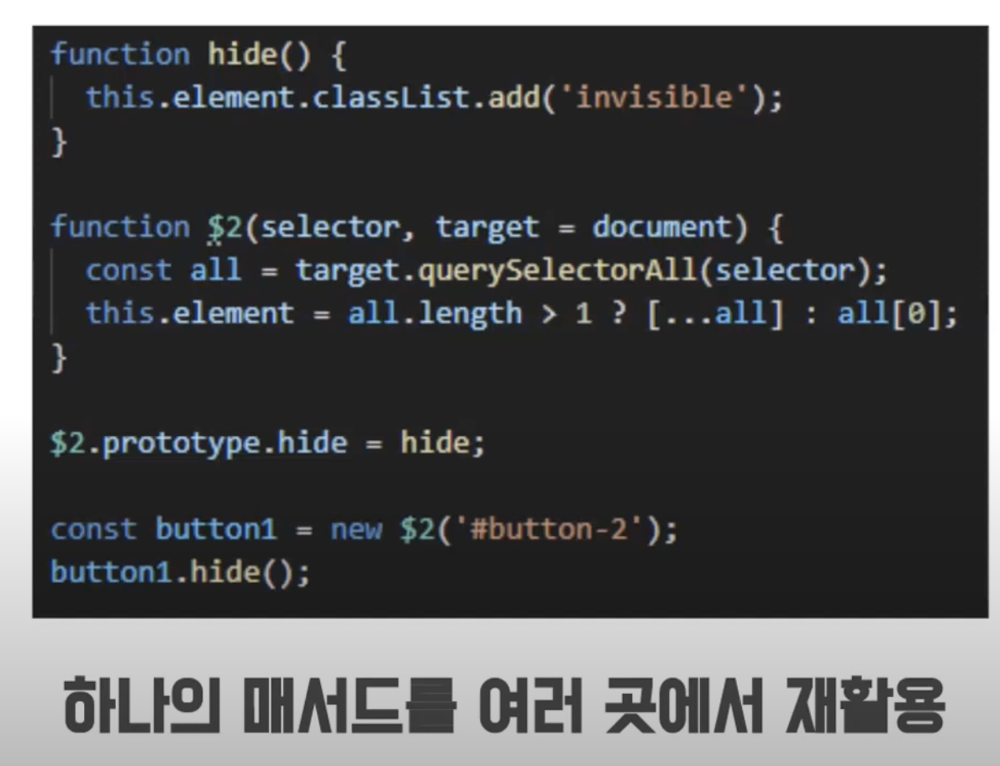

# prototype

> 자바스크립트에서 object간의 상속관계를 나타내는 개념. [[10분 테코톡] 💼 크리스의 Prototype
> ](https://www.youtube.com/watch?v=RYxgNZW3wl0&t=346s) 영상에서는 *상속관계*라는 말보다는 _연결_ 이라는 단어를 사용함으로서, prototype 기존 객체지향언어에서 말하는 상속과는 구분된 개념임을 강조한다.

## 객체간의 연결관계 이해하기

<figure>

<figcaption align = "center">출처: <a href='https://www.youtube.com/watch?v=RYxgNZW3wl0&t=346s'>[10분 테코톡] 💼 크리스의 Prototype
</a></figcaption>
</figure>

먼저, `Person`이라는 생성자함수의 `prototype` 속성은, 객체를 값으로 갖는다. 이 `Person`의 `prototype` 객체는 constructor를 갖는데, 그 constructor는 `Person`이라는 생성자함수이다.

그런데 `Person`이라는 생성자함수로 인해 생성된 `kim`이라는 객체의 `__proto__` 속성은 `Person`객체의 `prototype`을 가리킨다.

참 요상한 참조관계이다.

## `prototype`은 뭐고 `__proto__`는 뭐야?

### `__proto__`

우리가 흔히 프로토타입 / 프로토타입체이닝을 말할 때의 프로토타입은 특정 객체의 `__proto__` 속성이다. 이 `__proto__` 속성이 객체간의 연결을 담당한다.

### `prototype`

[이 stackoverflow](https://stackoverflow.com/questions/9959727/proto-vs-prototype-in-javascript) 답변에서는, `prototype`을 다음과 같이 설명한다.

**_"`prototype` is the object that is used to build `proto` when you create an object with `new`"_**

그래서 다음과 같은 결과를 갖는다:

```javascript
new Foo().__proto__ === Foo.prototype;
(new Foo()).prototype) === undefined;
```

## 프로토타입(`__proto__`)은 모든 객체가 가지고 있는 속성이다.

위에서 프로토타입은 객체간의 연결을 나타낸다고 하였다. 그리고 중요한 점은, 모든 자바스크립트 오브젝트는 `__proto__` 속성을 가지고 있다.

그래서 위 코드의 `Foo.prototype` (혹은 임의의 생성자 함수의 `prototype`) 또한 자바스크립트 object이므로, `Foo.prototype.__proto__`도 당연히 존재한다. 이 상황에선 아래 코드가 성립한다.

```javascript
Foo.prototype.__proto__ === Object.prototype;
```

<!-- 어찌보면 이해가 가지 않는가? `Foo.prototype`도 결국 object이다. `new Foo`로 인해 생성된 "object"와 같이, `Foo.prototype`도 "object"이고, "object"라면 `__proto__` 속성을 가지고 있을 것이다.

또한 `Foo.prototype`은 "object"이기 때문에, 그 object를 찍어내는 생성자 함수가 있을 것이다.

그것이 바로 `Object.prototype`인 것이다. -->

그럼 아래와 같은 코드도 성립할 것이다.

```javascript
Foo.prototype.__proto__.constructor === Object.prototype.constructor === Object
```

즉, `Foo.prototype.__proto__`는 `Object` 타입이라는 것.

## 잠깐만, constructor function도 결국 object아냐?

이에 대한 답은 [개념 - constructor](./%EA%B0%9C%EB%85%90%20-%20constructor.md)에서 다루겠다.

<!-- 맞다. 그러면 constructor function도 `__proto__` 속성이 존재해야한다. [MDN web docs](https://developer.mozilla.org/en-US/docs/Web/JavaScript/Reference/Global_Objects/Function)에 따르면, 자바스크립트에서 함수(`function`)은 `Function`이라는 constructor에 의해 생성된 object들이다.

그래서 한번 찍어보면:

```javascript
function Person(name) {
  this.name = name;
  this.sayHello = function () {
    console.log("Hello");
  };
}
```



이런식으로 나온다. 그런데 `Person.__proto__.constructor`를 찍어봐도 같은 결과가 나오는데, 이를 `function` 객체라고 이해하기 보단 native code, 즉, `Person.__proto__`와 `Person.__proto__.constructor`를 정의하는 native code로 이해하는 것이 나을 것 같다. -->

## 프로토타입 체이닝과 property 할당

```javascript
// 출처: [[10분 테코톡] 💼 크리스의 Prototype](https://www.youtube.com/watch?v=RYxgNZW3wl0&t=346s)

function sayHello() {
  console.log("hello");
}

function Person(name) {
  this.name = name;
}

const chan = new Person("chan");
Person.prototype.sayHello = sayHello;

chan.sayHello();
```

위와 같은 코드에

```javascript
chan.sayHello = function () {
  console.log("hi");
};
```

이렇게 `sayHello`를 덮어씌우면 어떻게 될까?

**_참 뭐같은 대답이지만, 답은 "상황에 따라 다르다" 이다._**

### 읽기전용 property일 경우

<figure>

<figcaption align = "center">출처: <a href='https://www.youtube.com/watch?v=RYxgNZW3wl0&t=346s'>[10분 테코톡] 💼 크리스의 Prototype
</a></figcaption>
</figure>

보이는 것처럼, `sayHello` 함수가 read-only property라면, strict mode에서는 당연히 에러가 날 것이고, non-strict-mode에서는 아무 문제 없을 것이다.

### 읽기전용이 아닌 경우

<figure>

<figcaption align = "center">출처: <a href='https://www.youtube.com/watch?v=RYxgNZW3wl0&t=346s'>[10분 테코톡] 💼 크리스의 Prototype
</a></figcaption>
</figure>

아무문제 없고, `Person.prototype.sayHello`가 덮여쓰여지는 것이 아니라, `chan.sayHello`, 즉, `chan`이라는 object에 `sayHello`를 가진 새로운 함수 property가 생긴다.

이는 객체지향언어에서의 method overriding이랑 상당히 비슷한데, 자바스크립트에서는 *가려짐*이라고 한단다.

## 그래서 이거 프로토타입 어따 써먹어?

아래와 같은 코드가 있다고 하자.

<figure>

<figcaption align = "center">출처: <a href='https://www.youtube.com/watch?v=RYxgNZW3wl0&t=346s'>[10분 테코톡] 💼 크리스의 Prototype
</a></figcaption>
</figure>

위 코드는 selector에 부합하는 모든 DOM element에 `hide`라는 함수를 추가한다. **_이는, 메모리 측면에서 효율적이지 못하다._**

위 코드는 아래와 같이 개선 가능하다.

<figure>

<figcaption align = "center">출처: <a href='https://www.youtube.com/watch?v=RYxgNZW3wl0&t=346s'>[10분 테코톡] 💼 크리스의 Prototype
</a></figcaption>
</figure>

하지만 위와 같이 코드를 변경한다면, 프로토타입을 활용하여 메모리를 절약할 수 있게 된다!

> 회사 프로젝트에서 실제로 위와 동일한 상황을 맞딱뜨려 prototype을 사용하여 문제를 해결하였다. 사용하는 프로그래밍언어의 특징을 잘 아는 것이 문제해결에 도움이 된다는 점을 직접 체험하였다.

## 참고문헌

1. https://www.javascripttutorial.net/javascript-prototype/
2. https://www.youtube.com/watch?v=RYxgNZW3wl0&t=346s
