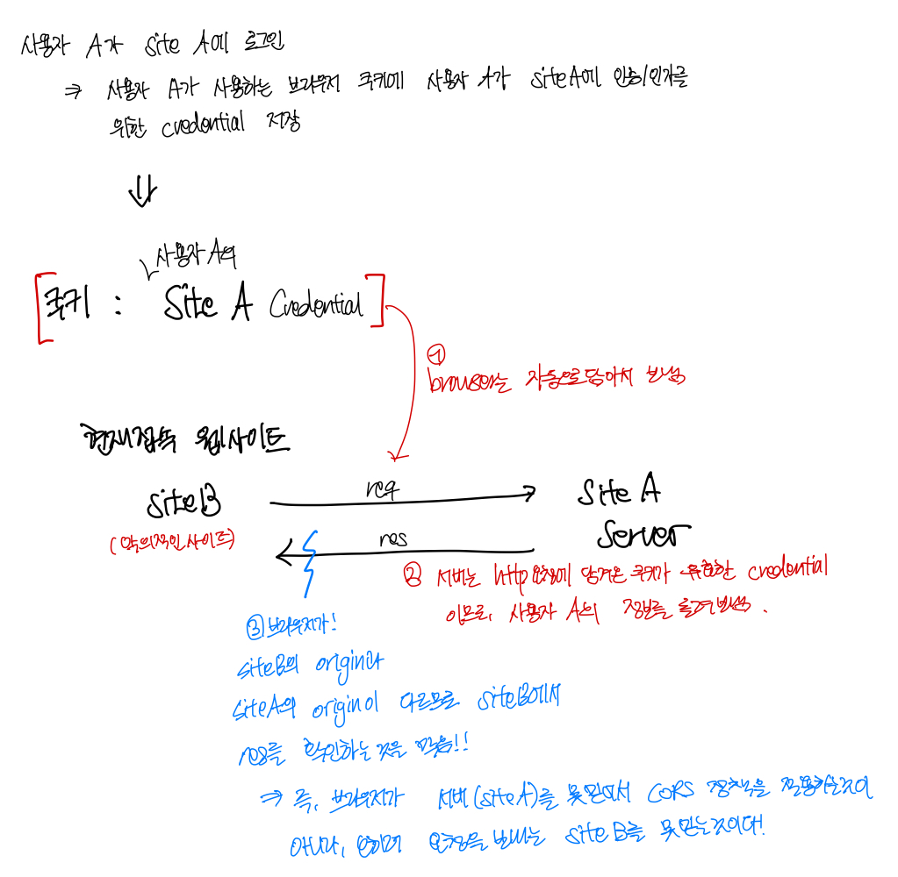

# CORS는 대체 누구를 위한 정책인가?

CORS 정책에 대해선 이전에 공부한 적이 있지만, 도대체 이게 누구를 위한 정책인지 와닿지가 않았다. 서비스를 사용하는 클라이언트를 보호하겠다는 것인가? 브라우저는 보호하겠다는 것인가? 서버를 보호하겠다는 것인가? 혹은 브라우저가 http요청에 대한 응답을 내려주는 서버를 믿지 못한다는 것인가?

그러던 중, [유튜브 동영상 - 웹개발 짜증유발자! CORS가 뭔가요?](https://www.youtube.com/watch?v=bW31xiNB8Nc&t=496s)을 보고, 드디어 CORS가 왜 필요한지 "표면적으로" 이해하게 되었다. "표면적"이라는 표현을 쓴 이유는, 내가 이해한바가 이론적으로 100% 맞지 않을 수 있고, 내가 납득할 수 있는 논리로 이해하려 했기 때문이다. 또한 이 과정에서 상황을 단순화 하기 위한 가정들도 세웠다.

## CORS는 사용자의 소중한 정보를 보호한다.

**_"CORS는 사용자의 소중한 정보를 보호한다"_** - 이것이 내가 이해한 CORS 정책의 목적이다. 사실 이는 CORS 정책을 좁은 의미로 이해한 것일 수도 있다.

그렇다면 CORS는 어떻게 사용자의 소중한 정보를 보호할까? 이를 이해하기 위해선 CORS 정책이 적용되는 대표적인 사례를 살펴봐야 한다.

위 그림에서 보는 것처럼:

- 사용자 A가 Site A에 로그인을하면, 그에 관련된 credentials들이 사용자 A가 이용하는 브라우저의 쿠키에 저장된다.
- **_쿠키는 기본적으로 브라우저에서 보내는 모든 http 요청에 함께 담아져 보내진다._** (물론 예외는 있다.) 그렇기 때문에, 해커가 Site A에 심어놓은 피싱링크(Site B)를 유저가 타고 들어가게되고, 그 페이지 내에서 해커가 Site A를 서빙하는 서버에 요청을 보낸다면, 브라우저 쿠키에 저장된 사용자 A의 credentials이 같이 보내질 것이다.
- (물론 서버단에서도 특정 Url에서만 들어오는 요청만 받겠다고 필터링 할 수도 잇지만,) 서버는 이 http 요청이 *사용자 A에 대한 유효한 credentials*을 제시하므로, 사용자 A의 소중한 개인정보도 응답으로 내려줄수 있다.
- 이제 해커는 사용자 A의 개인정보를 탈취하였다!

(사실 생각해보니, 위 그림은 전형적인 CSRF 공격 중 하나이다. 이를 막기 위해 `sameSite`와 같은 `Set-cookie` 헤더의 속성이 등장했다.)

위 처럼 굳이 악의적인 Site B가 아니더라도, CORS 정책이 없다면 어떤 사이트에서건 사이트(오리진) A와 관련된 쿠키를 마구 사용할 수 있게 된다.

아무튼 위의 예시 Site A와 Site B라는 origin이 다른 두 도메인 간의 자원 공유, 즉 정확히 Cross-Origin-Resource-Shareing의 상황을 보여준다. **_브라우저는 서버들을 못믿어서라기 보단, 오히려 요청을 보내는 웹사이트들을 못믿어서 (웹사이트를 이용하는 사용자를 못믿어서가 아니다) Cross-origin 간의 자원공유를 기본적으로 금지시키는 것이다._**

### CORS 정책을 쉽게 이해하기 위한 하나의 가정

위에서 말했다 시피, 서버가 특정 url에서 오는 요청만 받겠다고 내부적으로 구현할 수도 있겠지만, 그렇지 못할 경우 서버는 기본적으로 모든 http 요청에 응답하게 된다. **_CORS 정책을 쉽게 이해하려면 서버는 기본적으로 들어오는 모든 요청에 응답한다고 보면(혹은 가정하면) 편하다._**

### 그렇다면 API 통신들은 CORS 때문에 다 막히는거 아냐?

그런데, Site A 서버 입장에서는, OAuth/OIDC와 같은 로그인 서비스 처럼, 다른 origin에게 정보를 줘야할 일이 생긴다. 그 경우는, 서버가 응답을 보낼때 응답헤더에 `Access-Control-Allow-Origin`과 같은 헤더를 설정하여, 브라우저에게 "이 origin은 서버인 내가 신뢰하는 곳이야~" 라고 알림으로써, 브라우저가 CORS 정책을 적용하지 않아도 된다는 것을 알려준다.

### 그런데, 같은 API를 써도 브라우저에서는 CORS 정책을 위반했다는 에러가 나는데, POSTMAN 같은 api 테스트 도구에서는 오류가 안나던데요?

**_내가 이해한 바로는, 이는 CORS정책이 전적으로 브라우저에서 (대부분의 경우) 모든 http 요청에 쿠키를 함께 실어보내는 것 때문에 생긴 정책이기 때문이다._**

POSTMAN같은 api도구도 요즘 보면 쿠키를 같이 보내지만, 단순히 api 테스트 도구는 그렇지 않기(?) 때문이다.

## 그럼 Prefligt는 뭐야 도대체?

cross-origin에 해당하는 요청들 중, [simple request](https://developer.mozilla.org/en-US/docs/Web/HTTP/CORS#simple_requests)가 아니어서, 요청이 main 요청과 [preflight 요청](https://developer.mozilla.org/en-US/docs/Glossary/Preflight_request)으로 나뉘어서 전송되는 경우가 있다.

simple request가 아닌 요청은 대표적으로 `PUT`과 `DELETE` 메소드를 사용하는 요청들이다. 이런 메소드를 사용하는 cross-origin 요청의 경우, 브라우저가 본 요청을 보내기 전에 먼저 "preflight"라는 사전 요청을 OPTIONS 메소드로 보내어, 서버가 허용하는 http 메소드들이 무엇이 있는지, 그리고 어떤 cross-origin들을 허용하는지 확인한다.

**_이는 브라우저가 확인한다. 서버가 확인하는게 아니라, 사용자가 확인하는게 아니라, 브라우저가 확인한다._**

Preflight가 왜 필요한지는, 위에서 [CORS 정책을 쉽게 이해하기 위해 세운 가정](#cors-정책을-쉽게-이해하기-위한-하나의-가정): **"_서버는 기본적으로 들어오는 모든 요청을 처리한다."_** 를 상기시켜보면 이해하기 쉬워진다.

만약 Preflight라는 것이 존재하지 않고, 해커가 유저를 악의적인 링크를 통해 자신의 Site B로 이동시킨 다음, 거기서 Site A의 서버로 PUT/DELETE 요청을 보낸다고 하자. **_CORS 정책은, 서버가 요청을 처리하는 것을 막지는 못하고, 그 요청에 대한 응답을 브라우저단에서 컷할지 말지를 결정한다._** 그렇기에, 서버단에서는 일단 PUT/DELETE 요청을 처리는 할것이다. 이게 위험한 것이다. GET/POST요청 말고 PUT/DELETE 요청은 기존 DB를 훼손시킬 수 있는 요청이기 때문이다.

**_그래서! 브라우저는 cross-origin PUT/DELETE 요청을 보내기전에! Preflight를 통해 서버에게 cross-origin을 허용하는지, 한다면 어떤 http method들을 허용하는지 확인한 후 본 요청을 보내는 것이다! 이를 통해 서버의 자원과 민감한 정보를 최대한 보호할 수 있게 도와준다!_**
