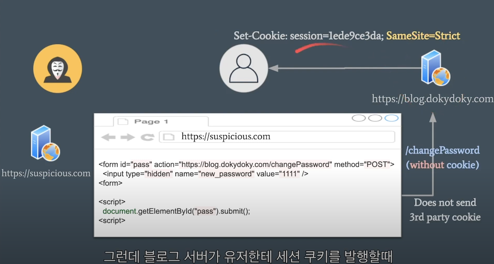

# 누가 쿠키를 볼 수 있는가?

쿠키는 서버와 클라이언트 간의 데이터를 교환하는 방식 중 하나로서, stateless한 http 프로토콜에서 state를 유지하는 방식으로 많이 쓰인다.

인증과 인가를 구현하기 위해 발급되는 sessionID와 각종 토큰들도 쿠키에 저장되곤 한다.

쿠키는 보통 _자동적으로_ http request에 담겨 서버로 보내진다. 하지만 쿠키가 언제 http 요청에 담기는지 클라이언트/서버 개발자가 컨트롤 할 수 없다면 이는 보안상으로 취약할 것이고, 이 취약점을 이용하는 것이 CSRF 공격이다.

<figure>

<figcaption align = "center">이미지 출처: <a href='https://www.youtube.com/watch?v=Q3YuKipzPbs&t=663s'>SameSite cookies explained / SameSite Cookie Attribute / CSRF</a></figcaption>
</figure>

이와 같은 보안적 취약점을 극복하기 위해, 쿠키에 대한 접근은 다양한 방식으로 제한된다.

# 쿠키에 대한 접근을 제한하는 다양한 방식

## `HttpOnly`, `Secure` 속성

`HttpOnly` 속성과 `Secure` 속성은 서버에서 클라이언트에게 보내는 응답에서 쿠키를 정의할 때 사용되는 `Set-Cookie` 헤더의 옵션들이다.

- `HttpOnly` 속성을 사용하면, 클라이언트의 자바스크립에서 `document.cookie`와 같은 방식으로 쿠키에 접근할 수 없다.
- `Secure` 속성을 사용하면 https 통신일 때만 쿠키가 전송된다.

## `Domain` 속성

이 속성 또한 `Set-Cookie` 헤더의 옵션중의 하나이다. 이 속성은 쉽게 말해 _누가 쿠키를 받을 수 있는지_ 정의한다. 근데 중요한건, `A.com`이라는 도메인에서 온 쿠키는 `B.com`과 같은 다른 도메인에는 절대로 보내질 수 없다. 이는, 일단 보안상으로도 말도 안되는 일이고, 설령 `Domain` 속성을 `B.com`으로 설정한들, [MDN 공식문서](https://developer.mozilla.org/en-US/docs/Web/HTTP/Headers/Set-Cookie#invalid_domains)에 의하면 이 쿠키는 브라우저단에서 아예 거절해버린다.

그렇다면 `Domain` 속성은 뭘 규제하는가?

1. `A.com/test`에 보낸 요청에 대한 응답의 `Set-Cookie` 헤더에 `Domain`속성이 정해지지 않으면, 오로지 `A.com`으로 요청을 보낼때만 쿠키가 담겨진다.
2. 하지만 오히려 `A.com`으로 `Domain` 속성을 정의해 버리면, `A.com`과 더불에 `foo.A.com`과 같은 subdomain에 요청을 보낼때도 쿠키가 담긴다고 한다.

이는 [mdn 공식문서](https://developer.mozilla.org/en-US/docs/Web/HTTP/Cookies#define_where_cookies_are_sent)에도 잘 설명이 되있다.

`Domain`말고 `Path` 속성도 있는데, 이에 대한 설명은 생각한다.

아무튼 중요한건, **_`Set-Cookie` 헤더의 `Domain` 속성 설정을 통해 쿠키의 행선지를 맘대로 정할 수 있는 것이 아니다. 쿠키는 오직 그 쿠키를 준 도메인과 (domain 속성값 설정을 통해) 그 도메인의 서브도메인으로만 갈 수 있다._**

위 사실은 내가 카카오 로그인 기능을 구현하기 위해 만들었던 리액트 페이지 이외에 다른 html 파일을 브라우저에 띄운 페이지에서 백엔드서버에 아무 요청이나 보냈을 때, `sameSite = none`인 쿠키가 요청에 담겨 보내지는 것을 통해 증명할 수 있었다.

## sameSite

쿠키에 대한 접근을 제한하는 방식 중에서 가장 대표적인 방식이다. 이 방식을 이해하려면 먼저 *first party cookie*와 *third party cookie*가 뭔지 부터 이해해야한다.

### first party cookies

**_http 요청을 보낼때의 브라우저의 주소창에 찍혀있는 주소와 그 요청을 받는 URL\(서버\)의 주소가 일치_** 했을때, 그 요청에 대한 응답으로 쿠키가 온다면, 그 쿠키는 **_first party cookie_** 이다. 아래 그림처럼 말이다:

<figure>

<figcaption align = "center">이미지 출처: <a href='https://www.youtube.com/watch?v=GPz7onXjP_4'>SameSite Cookies - Chrome Update
</a></figcaption>
</figure>

### third party cookies

하지만 우리가 위 그림의 예시처럼 `https://content.site`라는 URL로부터 웹페이지를 로딩할 때, 그 페이지 내에서는 다른 URL로 http 요청을 보내기도 한다. 예를들어 그 페이지안에 구글 에드센스 같은 것이 있거나, 아니면 특정 이미지/동영상을 `https://content.site`가 아닌 다른 URL에 요청을 보내 가져올 수 있다. 이러한 요청에 대한 응답들 또한 응답에 쿠키를 같이 반환할 수 있는데, 이것이 바로 _third party cookie_ 이다.

아래 그림은 third party cookies를 그림으로 잘 보여준다.

<figure>

<figcaption align = "center">이미지 출처: <a href='https://www.youtube.com/watch?v=GPz7onXjP_4'>SameSite Cookies - Chrome Update
</a></figcaption>
</figure>

### `sameSite = none`

sameSite는 `strict`, `lax`, `none`이 3가지이다. 이에 대한 자세한 설명은 [이 유튜브 동영상](https://www.youtube.com/watch?v=Q3YuKipzPbs&t=663s) [이 문서](https://developer.mozilla.org/en-US/docs/Web/HTTP/Headers/Set-Cookie/SameSite)를 참고하는게 정확하다.

그리고 sameSite의 판별 기준은 [이 글](https://web.dev/same-site-same-origin/)에 잘 나와있다.

다만, 개인적으로 `none` 옵션을 이해하는데 있어 헷갈리는 점들이 있었는데, 그 부분들은 좀 정리해야할 것 같다.

- 이게 이름이 `sameSite = none`이라고해서, 모든 http 요청에 쿠키가 담겨서 보내진다고 생각하면 안된다.
- 이 경우, 쿠키가 third party context에서도 보내진다.
- third party context라는 것은:
  - 유저가 `A.com`에 접속해서 쿠키를 받는다. 그 쿠키는 브라우저에 저장된다.
  - 유저가 `B.com`으로 이동한다. 이제 유저가 브라우저에서 `B.com`에 접속해 있을 때 기준으로는 `A.com`이 준 쿠키는 third party cookie이다.
  - 이제 `B.com`에서 `A.com`으로 요청을 보낸다. 이게 바로 third party context이다.

`sameSite = none`이면, 위 상황에서 쿠키가 `A.com`으로 보내는 요청에 담겨 함께 보내진다.

**_즉, `sameSite` 속성은, 브라우저 단에서 자기가 소유하고 있는 쿠키를 어디에다가 보낼지를 결정한다기 보다는, 이미 `Domain` 속성을 통해 목적지가 특정 서버로 정해져있는 쿠키를, 그 서버와 같은 site인 URL에서만 (first party context) 보낼 수 있도록 할지, 아니면 다른 site (third party context)에서도 보낼 수 있을지를 결정하는 것이다._**

## CORS 상황에서의 접근

> 일단 CORS 상황에서는, `sameSite`에 관한 개념은 잠시 접어두자.

CORS 상황에서는

1. http요청을 보내는 client는, axios를 이용할 경우 `withCredentials`과 같은 옵션을 반드시 설정해주고,
2. 서버에서는 반드시 응답헤더에 `Access-Control-Allow-Credentials`를 설정한다. 이 경우에는 `Access-Control-Allow-Origin` 헤더에 더이상 `와일드카드(*)`를 넣을 수 없으니 origin을 제대로 설정해줘야한다.
3. 이제 서버에서 내려주는 응답의 헤더에는 무조건 `sameSite = none`과 `secure` 옵션이 설정되 있어야 한다.

이렇게 하지 않으면 안된다. 그게 브라우저의 정책이다.

## CORS 상황에서는 sameSite (first party context)여도 상관이 없다.

재밌는 점은, 실제로는 first party cookie 인데, CORS 요청이라서 어쩔수 없이 응답헤더에 `sameSite = none` 속성을 사용해야하기도 한다는 점이다.

이는 다음의 예시로 확인할 수 있다.

1. FE는 `localhost:3000`로 접속할 수 있다.
2. BE는 `localhost:3002`로 접속할 수 있다. 하지만 hosts 파일 수정을 통해 `brad-oidc.com:3002`로도 접속이 가능하다.
3. 이제 FE가 브라우저에 보여주는 웹페이지에서 BE에 요청을 보낸다. 이때 요청을 각각 `localhost:3002`와 `brad-oidc.com:3002`로 보내보자. 두 요청은 사실상 같은 서버로 가는 것이다. 이때 이 서버는 응답으로 쿠키를 내려준다.

   - `localhost:3002`로 보낸 요청에 대한 응답으로 내려온 쿠키는 `localhost:3000` 입장에서는 first party cookie이다. 왜냐하면 [쿠키는 not-port-specific 하기 때문이다](https://stackoverflow.com/questions/1612177/are-http-cookies-port-specific).

     - 그래서 `localhost:3000`가 띄워주는 페이지에 접속한 후 개발자 도구를 통해 Application 탭에서 쿠키를 확인해 보면, 아래와 같이 담겨있는 것을 볼 수 있다.

         

     - 그러나 브라우저에서 `brad-oidc.com:3002`로 접속해 개발자도구를 열어보면 아래 그림처럼 아무 쿠키도 없는 것을 알 수있다.
       

   - 반대로 `brad-oidc.com:3002`로 보낸 요청에 대한 응답으로 내려온 쿠키는 `localhost:3000` 입장에서는 third party cookie이다.

     - 따라서, `localhost:3000`가 띄워주는 페이지에 접속한 후 개발자 도구를 통해 Application 탭에서 쿠키를 확인해 보면, 아래와 같이 쿠키가 담겨있지 않다.

         

     - 하지만 브라우저에서 `brad-oidc.com:3002`로 접속해 개발자도구를 열어보면 아래 그림처럼 쿠키가 `brad-oidc.com:3002` 아래 저장된 것을 알 수있다.

         

**_크롬 브라우저의 개발자 도구가 접속한 사이트의 first party cookie를 위와 같이 쿠키 란의 그 사이트 그룹에 보여준다면, CORS 상황에서는 first party / third party 여부 상관없이 전부 `sameSite = none`이 되어야 한다._**

> 그런데 위 사실을 정확히 증명하는 문서는 찾지 못했다. 근데 [이 링크](https://cookie-script.com/all-you-need-to-know-about-third-party-cookies.html?amp=1)에 중간에 나오는 그림(아래 참고)을 보면 맞는 것 같다 ㅠㅠㅠㅠ

<figure>

<figcaption align = "center">이미지 출처: <a href='https://cookie-script.com/all-you-need-to-know-about-third-party-cookies.html?amp=1'>All You Need to Know About Third-Party Cookies</a></figcaption>
</figure>

# 정리

쿠키는 서버가 설정한다. 그러기에 쿠키에 대한 접근을 제한하는 것도 서버 측에서 설정을 하게되고, 서버의 재량이다.

## 참고 문서

1. https://developer.mozilla.org/en-US/docs/Web/HTTP/Cookies
2. https://web.dev/same-site-same-origin/
3. https://velog.io/@code-bebop/CORS%EC%9D%98-Cookie
4. https://stackoverflow.com/questions/1612177/are-http-cookies-port-specific

<!--
# 헐, redirect-uri를 brad-oidc.com으로 했더니 된다.
모든 문제는 redirect-uri에 있엇다.
redirect uri를 localhost로 설정햇을때는, 쿠키를 내려준 사람이 localhost:3002였다. 왜냐면 redirect uri에서 쿠키를 내려주는 응답을 하니까. 그런데 UserForm에서 요청을 보낼때는 brad-oidc로 보냈다. 당연히 쿠키가 안가지

하지만 redirect uri를 localhost가 아닌 brad-oidc로 했을 때에는 쿠키를 내려준 사람미 brad-oidc이다. 그래서 UserForm에서 brad-oidc로 요청을 보낼때, 쿠키가 담겨서 간다.

이는 set cookie시 domain을 명시하지 않을 경우, domain이 쿠키를 발행한 exact URL이 도메인이 된다.

여기서 주의해야할 점은, domain은 다른 서버로 쿠키를 전송케 하는 것이 아니다.
- https://stackoverflow.com/questions/61000089/does-the-domain-attribute-affect-samesite-on-an-http-cookie
- https://developer.mozilla.org/en-US/docs/Web/HTTP/Headers/Set-Cookie#invalid_domains
- https://developer.mozilla.org/en-US/docs/Web/HTTP/Cookies#define_where_cookies_are_sent

이 세 정보를 조합해보면,
- 도메인을 설정하지 않았으면, 예를들어, 쿠키가 example.com에서 왔을 경우, 오직 example.com으로 요청을 보낼때만 쿠키가 담겨간다.
- 하지만 오히려 도메인을 explicit하게 example.com으로 정했을 경우, example.com과 그 subdomain들, 즉 foo.example.com 등으로 요청을 보낼 때에도 쿠키가 같이 전송된다. 그래서 3번째 링크에서 "Therefore, specifying Domain is less restrictive than omitting it." 이렇게 말하는 것이다.
- 두번째 링크에 의하면, "A cookie for a domain that does not include the server that set it should be rejected by the user agent." 라고 한다. 즉, domain 설정을 통해 쿠키가 쿠키를 발급해준 서버 말고 다른 서버로의 요청에 담기게 할수가 없는 것이다.

그렇다면 sameSite none은 대체 무엇인가?
- 일단 sameSite와 sameOrigin은 다르다 https://stitchcoding.tistory.com/46
- sameSite는 서버랑 다른 사이트에서 오는 서버가 설정한 쿠키를 서버가 받을 수 있다는 거지, 다른 서버가 세팅해준 쿠키를 막보낼수있다는게 아닌듯?
    - 맞다... sameSite

first/ third party는 요청을 보내는 웹사이트 기준 쿠키의 목적지가 웹사이트와 site가 같냐 마냐를 가지고만 본다.
즉, sameSite는 결국 third party context, 즉 XSRF공격이 되는 환경 같은 곳에서도 쿠키가 전송되냐마냐를 알려준다.
- 결국 쿠키는 목적지는 일단 domain을 통해 정해지고
- sameSite는 쿠키가 보내지는 상황이 발신자 기준 third party인지 first party인지를 정하는것...

브라우저의 개발자 도구와 document cookie로는 first party cookie만 보여진다. Firstparty cookie를 구별지을 때는 포트를 따지지 않으므로 localhost:3000인 FE에서 localhost:3002인 BE 사이에서 first party cookie로 취급된듯.
하지만 쿠키입장에서는 sameSite인데 브라우저 입장에서는 CORS인 경우, sameSite none을 해주지 않으면 브라우저가 쿠키를 담아서 보내지 않는다. ㅠㅠ
- 이말이 맞는것 같다. 아니라면 localhost:3000 - localhost:3002의 경우에 브라우저 개발자 도구에서 쿠키를 볼수 있는게 말이 안됨 -->
