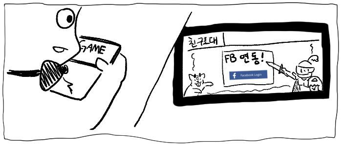
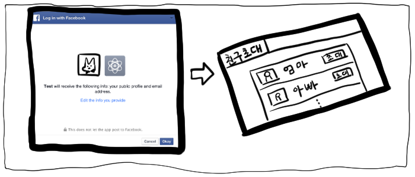
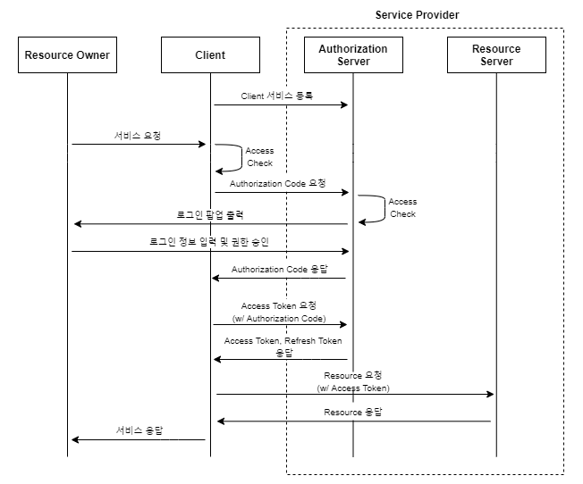
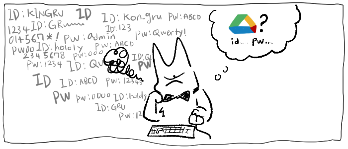
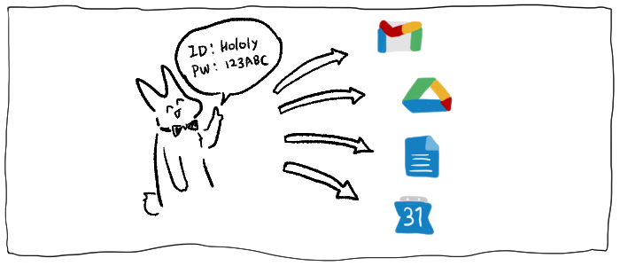

# OAuth와 OpenID Connect (1) - OAuth

OAuth란 무엇인가? 

개인적으로 웹개발의 기본 중 하나인 로그인/회원가입 시스템을 공부하면서, OAuth라는 단어를 맞딱뜨렸을 때 당황부터 했었다. OAuth는 독립적인 개념이 아니라 인증과 인가라는 주제 안에서 하나의 부분을 차지하고 있으며, 그안에는 토큰과 같은 개념도 사용된다. 또한, OAuth를 제대로 이해하기 위해서는 인증과 인가라는 큰 틀 안에서 그 등장배경을 살펴봐야 할 것이고, 어떤 점이 OAuth의 단점으로 작용하여 Open ID Connect라는 개념이 나왔나 까지 살펴봐야 한다.

딱봐도 복잡하지 않은가? 그런데, OAuth를 공부해 본 결과, 직접 OAuth 및 OIDC 서비스를 구현해서 제공하는 provider가 되지는 않을 지라도, 적어도 관련개념들은 알아야 요즘 어디서나 쓰이는 *카카오톡으로 로그인하기*와 같은 평범하지만 멋진 기능을 내 서비스에 (제대로 이해하고) 넣어볼 수 있다는 점을 깨달았다.

이 글에는 내가 OAuth를 공부하며 배웠던 점들, 들었던 의문들, 그리고 나의 생각들을 기록할 것이다. 이 글은, OAuth와 OIDC를 직접 구현 및 사용 하기 전 오로지 개념적으로만 이해를 하고 쓴 글이기에, 정확하지 않은 내용이 포함되어 있을 수 있다. 또한 직접 OAuth/OIDC 서비스를 사용해보고 나서 내용이 바뀔 수도 있다.

이 글의 내용은 다음 두 글을 참고로 작성되었다.
1. [호다닥 공부해보는 SSO와 친구들 (SAML, OAuth, OIDC)](https://gruuuuu.github.io/security/ssofriends/)
2. [User Authentication with OAuth 2.0](https://oauth.net/articles/authentication/)

## OAuth 이해하기

### OAuth의 정의

아, 참고로 정확한 명칭은 *OAuth 2.0*인데, 이전 버전인 OAuth 1.0은 OAuth 2.0과 작동방식도 다르고 이제는 OAuth 1.0이 보안적 이슈 땜에 추천되지 않는다.

OAuth는 다음 한 문장으로 요악된다. 다음 문장은 이해하고 말고의 문제가 아니다. 그냥 팩트로 받아들여야 한다.

> __*OAuth 2.0 is not an authentication protocol.*__

그렇다. OAuth는 인증(Authorization)이 아닌 인가(Authentication)을 위한 프로토콜이다. 그런데 우리는 간혹 [카카오로그인](https://developers.kakao.com/docs/latest/ko/kakaologin/common)과 같은 소셜로그인 기능을 보면서, OAuth가 언급되니까 OAuth가 인증 기능도 해주는 프로토콜이라고 착각하기 쉽다. OAuth가 왜 인증을 위한 프로토콜이 아닌지, 왜 인증을 위해서 쓰이면 안되는지, 그리고 이 문제를 해결하기 위해 나온 OIDC에 대해서는 뒤에서 자세하게 설명할 것이다.

그리고 언급했듯이, OAuth는 인가를 위한 *프로토콜*이다. 즉, OAuth는 특정 벤더에서 제공하는 서비스가 아니고, 여러 벤더들이 특정 서비스를 만들 때 따를 수 있는 규약이며, "우리 서비스는 OAuth 규약을 지켜요~"라고 말할 수 있는 것이다.

공식화된 규약이므로, OAuth를 따라 구현된 서비스를 사용하는 클라이언트들은, 벤더와 상관없이 같은 방식으로 서비스를 이용할 수 있는 것이다.

그럼 이제는 OAuth라는 프로토콜에 대해 조금더 자세히 알아보자.

### OAuth의 개념

[앞 섹션](#oauth의-정의)에서 언급했다시피, OAuth는 인가를 위한 프로토콜이다. 인가는 쉽게 말하면 *권한을 준다* 라는 말이다. 그런데 대체 누가 누구에게 어떤 권한을 준다는 말인가? 이를 이해하기 위해서는 OAuth가 어디서 쓰이는지 살펴보면 된다.

<figure>

<figcaption align = "center">출처: <a href='https://gruuuuu.github.io/security/ssofriends/'>호다닥 공부해보는 SSO와 친구들 (SAML, OAuth, OIDC)
</a></figcaption>
</figure>

위 그림 처럼 특정 게임에서 "페이스북과 연동하여 친구초대" 라는 기능이 있다고 하자. 페이스북 버튼을 클릭하면 보통 아래 그림과 같은 화면이 나올 것이다.

<figure>

<figcaption align = "center">출처: <a href='https://gruuuuu.github.io/security/ssofriends/'>호다닥 공부해보는 SSO와 친구들 (SAML, OAuth, OIDC)
</a></figcaption>
</figure>

이제 여기서 플레이어(게임의 사용자)가 "수락"과 같은 버튼을 클릭하면, 게임 내에서 사용자의 페이스북 친구 목록을 조회할 수 있게 된다.

여기서 *게임의 사용자*가 *게임*이라는 서비스에게 *페이스북에 있는 본인의 친구목록을 조회할 수 있는 권한*을 준 것이다.

이게 사실 OAuth 개념의 전부이다. 조금더 일반화해서 설명하면: 

> __*OAuth란, A의 사용자가 본인만 접근할 수 있는 서비스 A의 기능에 다른 서비스 B가 접근할 수 있도록 서비스 B에게 권한을 주기 위해 따라야하는 프로토콜 이다.*__

그럼 이제 위 개념을 바탕으로 OAuth 프로토콜의 참여자를 정의할 수 있게 된다:

1. Client: third party app
    - 위의 예에서 게임 앱
2. Service Provider:
    - Authorization Server: 인가를 하기 위한 서버
    - Resource Server: 자원이 저장된 서버
    - service provider는 위의 예에서 페이스북
3. Resource Owner: 자원 소유자 == 유저 
    - 여기서 유저는 Client와 Service Provider가 제공하는 서비스를 동시에 이용한다.
    - 위의 예에서 게임 플레이어

처음에 Client를 유저라고 생각했고, Resource Owner라고 생각해서 헷갈렸다. 그런데 third party app은 Service Provider가 제공하는 기능을 이용하므로, Client가 된다. 그리고 Client가 접근하는 자원은 실제로는 유저에게 속한 자원이므로, 유저가 Resource Owner가 된다.

### OAuth Workflow

OAuth는 다음과 같은 flow를 가진다.

<figure>

<figcaption align = "center">출처: <a href='https://gruuuuu.github.io/security/ssofriends/'>호다닥 공부해보는 SSO와 친구들 (SAML, OAuth, OIDC)
</a></figcaption>
</figure>

0. Client 서비스 등록
    - Service Provider가 제공하는 계정 연동기능을 사용하기 위해선 클라이언트가 먼저 자신의 서비스를 등록한다.
    - 이를 통해 service provider는 redirect uri를 확인할 수 있다.
1. Resource owner (user)가 클라이언트에게 "페이스북 계정 연동"과 같은 서비스를 요청한다.
2. Access Check
    - 쉽게 말해 해당 유저를 통해 Service Provider로 부터 발급받은
3. Authorization Code 요청
    - 인가코드는 뒤에 나올 Access Token을 받기 위해 사용된다.
    - 인가코드는 client가 service provider에서 resource owner가 이용할 수 있는 기능을 어느 범위 까지 인가 받았는지 말해준다. 
    - 즉, 인가코드는 client가 resource owner로 부터 권한을 위임받을 수 있다는 사실을 증명하며, 뒤에 나오는 access token은 실제 권한을 의미한다.
4. Access Check
    - 서버내의 access 정보가 없다면 로그인 팝업을 띄워 유저에게 Service Provider가 제공하는 서비스의 계정으로 로그인하게 한다.
    - 이에 성공하면 Service Provider는 Client에게 authorization code를 발급한다.
5. 이제 client는 이 authorization code를 통해 access token과 refresh token을 발급받을 수 있고, 두 토큰이 유효한 시간 동안에 두 토큰을 이용하여 Service Provider로 부터 유저가 허락한 정보에 유저대신 접근 할 수 있는 것이다.

중간 중간 몇개 스텝은 귀찮아서 스킵했다 ㅋㅋ

Authorization code는 사실상 Access Token과 Refresh 토큰 발급을 위해서 발급된 것이며, [그 수명은 아주 짧다고 한다](https://stackoverflow.com/questions/42346476/oauth-2-authorization-code-how-long-is-it-valid).

### OAuth의 장점

위에 예시에서 볼 수 있다시피 OAuth를 이용하게 된다면, 유저 입장에서는 서비스 A에만 가입했는데 그 계정으로 서비스 B도 이용할 수 있게된다. 또한, 서비스 B에서 서비스 A에 있는 유저의 정보를 받아올 때, 유저는 서비스 B에 본인의 서비스 A 계정에 대한 정보를 단 하나도 입력할 필요가 없어 보안적으로도 장점을 가진다.

이러한 장점을 살려 OAuth가 십분 활용되는 곳은 *Single Sign On (SSO)*이다. SSO는 이름에서도 알 수 있듯이 하나의 계정으로 여러 서비스를 이용할 수 있는 것을 뜻한다.

<figure>

<figcaption align = "center">출처: <a href='https://gruuuuu.github.io/security/ssofriends/'>호다닥 공부해보는 SSO와 친구들 (SAML, OAuth, OIDC)
</a></figcaption>
</figure>

위 그림에서 보는 것처럼 각 서비스 마다 계정을 만들어야 한다면 매우 불편하겠지만, 

<figure>

<figcaption align = "center">출처: <a href='https://gruuuuu.github.io/security/ssofriends/'>호다닥 공부해보는 SSO와 친구들 (SAML, OAuth, OIDC)
</a></figcaption>
</figure>

이렇게 하나의 계정으로 여러 서비스를 이용할 수 있게 하는 것이 Single Sign On이다.

Single Sign On에 대한 설명은 여기까지만 하고, 필요하면 나중에 공부하는 것으로 하자.

## OAuth와 인증

OAuth에 대해 전반적으로 살펴봤을 때, 이게 인가를 위한 프로토콜이라고는 하지만, 인증을 위해서도 사용될 수 있는 것 처럼 보인다. 그런데 [User Authentication with OAuth 2.0](https://oauth.net/articles/authentication/)
에서는 절대 OAuth만을 단독으로 인증기능으로 사용하지 말라고 당부 한다. 그 이유를 알기 위해 다음 개념들을 차례대로 살펴봐야 한다.

### 인증이란?

[User Authentication with OAuth 2.0](https://oauth.net/articles/authentication/)에서는 다음 두가지 조건이 만족되야 인증의 수단으로 쓰일 수 있다고 강조한다.

#### 인증수단이 되기 위한 조건

1. 서비스의 사용자의 presence를 증명할 수 있는가?
2. authentication의 증거로 사용되는 도구(예를들면 토큰)로 부터 사용자에 관한 정보를 추출해낼 수 있는가?

그리고 다음과 같은 이유fh OAuth는 인증의 수단으로 사용할 수 없다고 강조한다.

1. OAuth는 그 디자인 자체가 사용자의 presence랑은 아무련 관련이 없다. 사용자가 client 서비스를 사용하던 중, service provier 서비스에 저장된 사용자의 정보를 가져오고 싶을 경우, service provider 서비스에 로그인하면, service provider 서비스는 client 서비스에 access token을 발급한다. 그 access token이 유효한 기간 동안에는, 유저가 client 서비스를 이용하는 중이건 자고 있건 말건, client service는 service provider로 부터 유저에게 위임 받은 권한 만큼 service provier의 서비스를 이용할 수 있게 된다.
2. OAuth의 과정에서 발급되는 access token는 client 입장에서는 그냥 랜덤한 스트링일 뿐이다. 그러기에 client는 access token으로부터 유저에 관한 정보를 추출해 낼 수가 없다. 애초에 access token의 `audience`는 client가 아니다. client는 단순히 *access token을 소유할 수 있는 권한*을 가졌을 뿐이다. 
    - client가 access token을 발급받는데 왜 client가 access token의 audience가 아니냐고? 토큰의  [`audience`는 token을 받는 사람을 의미한다](https://stackoverflow.com/questions/28418360/jwt-json-web-token-audience-aud-versus-client-id-whats-the-difference). 근데 여기서 받는다는 것은 단순히 "받는다" 라는 의미가 아니라, "그 토큰의 최종 사용처"로 이해하는게 맞는 듯하다.
    - client가 resource server로 보낸 토큰은 그 유효성이 검증되어 client가 resource server로 부터 유저에 관한 정보를 받을 수 있게 해준다.
    - 결국, 토큰의 최종사용처는 그 토큰을 검증한 resource server인 것이고, client는 단지 *access token을 잠시 소유할 수 있는 권한*이 있었던 것이다.

### OAuth를 인증에 사용해도 될 것만 같은 느낌적인 느낌

위 설명에도 불구하고, OAuth를 인증에 사용해도 될것만 같은 느낌은 지울 수 없다. [위에 언급한 글](https://stackoverflow.com/questions/28418360/jwt-json-web-token-audience-aud-versus-client-id-whats-the-difference)에서는 왜 그 느낌이 드는지, 왜 그 느낌이 잘못됐는지 설명하는데, 그 중 대표적인 이유는 다음과 같다.

1. access token을 소유했다는 것 자체가 인증권한에 대한 증거 아닌가요?
    - 이 오해는, OAuth workflow의 과정 중에서, client가 access token을 받기전에 service provider가 제공한 페이지에서 사용자가 "로그인"을 하는데 기인한다. 사용자가 아이디와 비밀번호를 입력하고 나서 access token이 발급되기에, 그게 인증이 된거 아니냐 라는 것이다.
    - 그렇지만 이렇게 발급된 acess token은 [위에 나온 인증수단이 되기위한 조건](#인증수단이-되기-위한-조건)을 전부 만족시키지 못한다.
    - 이를 해결하기 위해 OpenID Connect (OIDC)라는 것이 등장했고, OIDC에서는 Id token이라는 것을 통해 문제를 해결한다.
2. access token을 가지고 유저만 접근할 수 있었던 protected API에 client api도 접근할 수 있게됬는데, 이게 인증의 증거 아닌가요?
    - 사실상 1번의 이유와 마찬가지로, client가 access token을 통해 protected API에 접근하는 시점은 유저가 로그인 한 시점 직후 일수도 있지만, 아닐수도 있다.
    - 로그인 한 직후에는 로그인 한 후 바로 client가 유저의 권한을 위임받아 사용하여 인증된 것처럼 보일 수 있다.
    - 하지만 로그인 하고 시간이 꽤 지난 시점, 즉 유저가 더이상 client 서비스를 이용하지 않는 시점에도 access token이 유효하다면, client는 여전히 access token을 사용하여 protected resource에 접근이 가능하다. 그러므로 service provider는 access token만으로는 유저의 Presence를 증명할 수 없으므로! OAuth는 단독으로 인증에 사용될 수 없다.

### 그래서 나온게 OpenID Connect

OIDC는 다음 포스트에서 이어진다. 아무튼 얘기가 길었다. 이것만 기억하자.

> __*OAuth는 유저의 권한을 위임하기 위한 프로토콜이다.*__