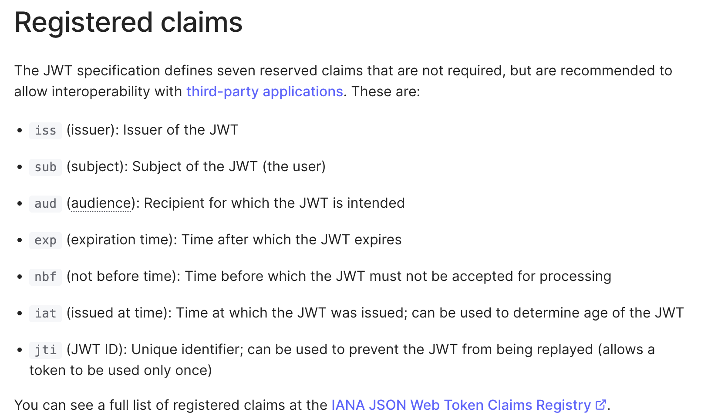

# OAuth와 OpenID Connect (2) - OpenID Connect (OIDC)

이전 글에서 OAuth는 단독으로 인증을 위해 사용될 수 없다고 설명하였다. 하지만, OAuth를 *활용*하여 인증 기능을 구현한 프로토콜이 있는데, 그 중 하나가 바로 `OpenID Connect (OIDC)`이다.

OIDC는 OAuth위에 인증을 위한 layer를 추가한다. 이를 위해 `ID Token`이라는 것을 활용한다.

<!-- 그런데 기억해야할 점은, <b><i>OIDC는 OAuth를 기반으로 하므로, OAuth에서 보여지던 "권한위임"의 형태가 인증에서도 그대로 쓰인다는 점</i></b>이다. 이게 무슨 말인지는 지금은 잘 이해가 안갈 것이다. -->

## ID token

OIDC에서는 access token과 더불어 ID Token이라는 것을 발급한다. ID token은 JWT이다. JWT를 사용함으로써 얻을 수 있는 점은 다음과 같다:

1. JWT의 특성상 토큰의 issuer를 검증할 수 있게 된다. 이는 https와 더불어 한층 강화된 보안을 제공한다.
2. JWT의 payload안에 다양한 정보(claims)를 저장할 수 있다:

   - 대략 이정도 인데

       <figure>
       
       <figcaption align = "center">출처: <a href='https://gruuuuu.github.io/security/ssofriends/'>JSON Web Token Claims</a></figcaption>
       </figure>

     위 claim들은 authentication session에 대한 정보를 담는데 활용될 수 있다고 한다.

   - JWT는 client 쪽에서도 parsing이 가능하기 때문에, 세션에 관한 정보를 client단에서도 추출해낼 수 있게된다.

## ID token은 authentication의 증거로 쓰일 수 있는가?

앞의 [OAuth 관련 글](./1_OAuth.md)에서 token이 authentication의 증거가 되기 위해서는 다음 두가지 조건을 만족해야한다고 하였다

1. 토큰에서 유저에 관련된 정보를 추출해 낼 수 있을 것
2. 토큰을 통해 user의 presenece를 알 수 있을것.

첫 번째 조건은 [위 섹션](#id-token)에서도 볼 수 있다시피, JWT의 claims을 통해 이 JW가 어떤 유저를 위해 발급 됬는지 식별할 수 있다.

두번째 조건은, 클라이언트에서 넘어오는 요청에 매번 토큰이 담겨있다면, 그것이 user의 presenece를 증명하는 것일 수 있다. 이는 access token과 반대되는데, access token은 유저의 동의에 의해 발급 된 후 서버가 수령해서 유효한 시간 동안 서버가 유저의 개입 없이 마음대로 resource provider에게 요청을 보내는데 사용할 수 있다.

<!-- ## ID Token이 있는데, access token은 왜 또 발급해?

내가 OIDC를 공부하면서 들었던 의문이다. OIDC를 통해 발급받은 ID Token이 인증의 역할을 한다고 했다. 그럼 이미 인증된 상태로서 client는 유저행세를 할 수 있는 것인데, 거기에 더불어 인가에 필요한 access token이 필요없는 것 같아 보였기 때문이다.

틀린 질문은 아닌데, "왜 access token도 발급되는가"에 대한 질문에 대한 답을 이렇다:

먼저, OIDC가 OAuth위에 지어진 프로토콜이라는 것을 알아야한다. OAuth의 핵심은 "권한의 위임"이다. OAuth를 통해 유저가 client에게 service provider의 서비스를 이용할 권한을 위힘했다. __*그런데 이제 OIDC를 통해서는 "로그인할 권한"까지 위임한 것이다!*__ 이는 OAuth와 OIDC의 workflow를 동시에 놓고 보면 이해하기 쉬워진다.

<figure>

<figcaption align = "center">출처: <a href='https://gruuuuu.github.io/security/ssofriends/'>호다닥 공부해보는 SSO와 친구들 (SAML, OAuth, OIDC)
</a>  왼쪽이 OAuth, 오른쪽이 OIDC의 flow</figcaption>
</figure>

OIDC 없이 OAuth만으로 client가 access token, 즉 권한을 위임받으려면, client가 권한 위임요청을 할때마다 매번!유저가 로그인 해야한다.

하지만, OIDC를 통해 id token을 발급받은 client는, 유저로 부터 <i>로그인할 권한 (즉, 인증)</i>을 받은 셈이니, 이제 access token이 필요할 때 유저가 직접 로그인할 필요가 없어진다. 그냥 client는 자기가 가지고 있는 id token을 service provider에 보내서 access token을 발급받으면 되는 것이다.

이렇게 OIDC는 여전히 OAuth의 *권한위임* 방식을 활용하여 인증을 구현해내므로, OIDC는 *adding authentication layer on top of OAuth* 라고 하는 것이다.

## 이제 개념적으론 이해가 갔으니 카카오로그인 서비스를 이용해 보며 직접 OIDC를 사용해보자!! -->

## 참고 문헌

[User Authentication with OAuth 2.0](https://oauth.net/articles/authentication/)
