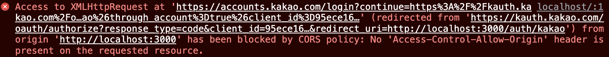
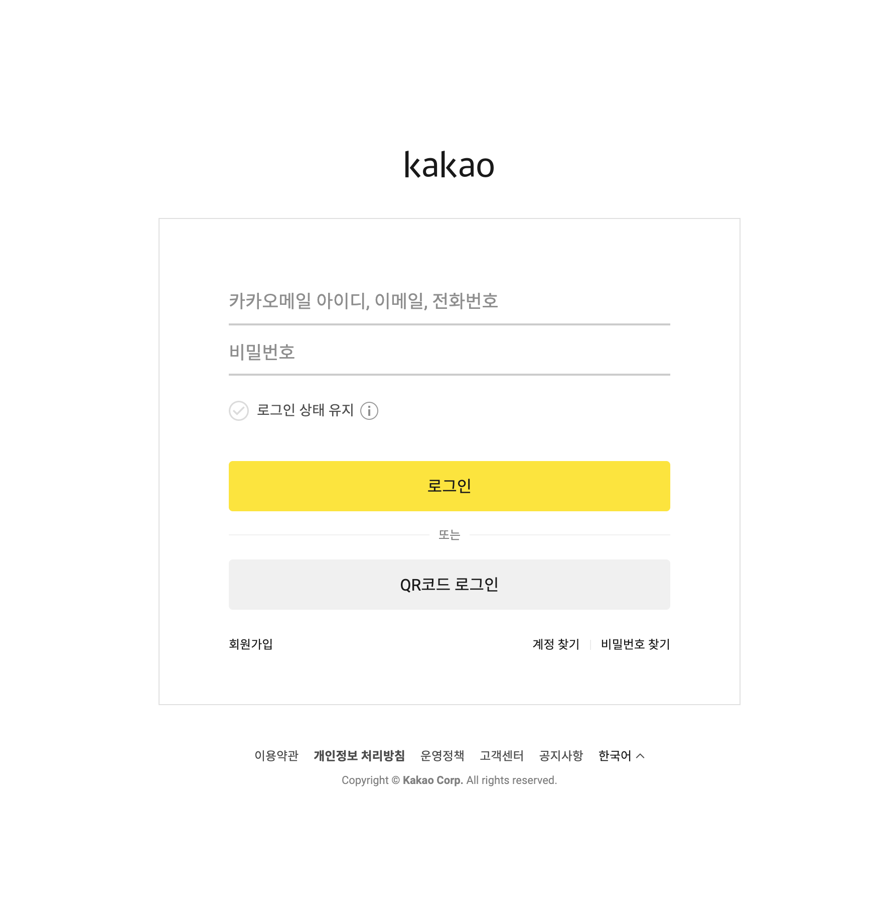
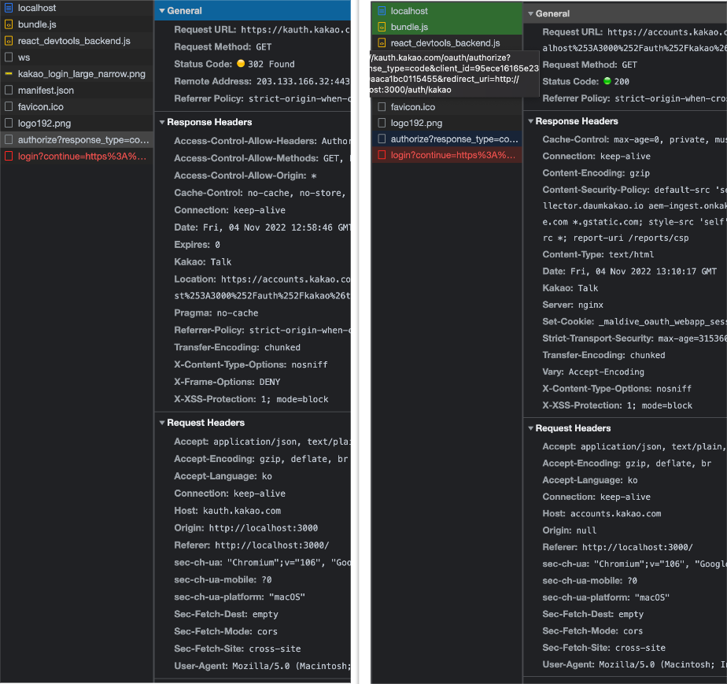
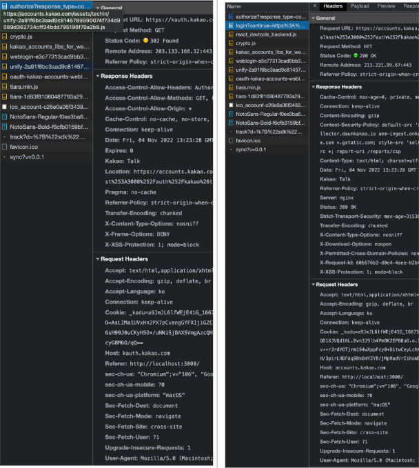

# 인가코드 받기 중 CORS 에러 발생

카카오로그인 기능을 구현하다가 또 CORS 에러를 마주쳤다. 에러는 다음과 같다.

## 해석해보자면:

1. http://localhost:3000 에서
2. https://kauth.kakao.com/oauth/authorize?response_type=code&client_id=${client_id}&redirect_uri=http://localhost:3000/auth/kakao 에 보낸 요청에 대하여
3. https://accounts.kakao.com/login?continue=https%3A%2F%2Fkauth.kakao.com%2Foauth%2Fauthorize%3Fresponse_type%3Dcode%26redirect_uri%3Dhttp%253A%252F%252Flocalhost%253A3000%252Fauth%252Fkakao%26through_account%3Dtrue%26client_id%3D${client_id} 로 redirect하라고 응답이 와서
4. 그 주소로 GET XMLHttpRequest을 보냈는데, 그 요청이 CORS 정책을 위반한 것이다.

위의 과정은 카카오로그인 기능 중 [인가코드 받기](https://developers.kakao.com/docs/latest/ko/kakaologin/rest-api#request-code)를 구현한다면 자연스레 발생하는 과정이다.

## 문제의 원인

위 문제는 카카오로그인을 위한 인가코드 받기 위해 API에 보내야하는 HTTP request를 **_프론트엔드의 자바스크립트에서_** 보냈기 때문에 발생한 문제이다.

그런데 프론트엔드의 자바스크립트는 브라우저에 의해서 실행된다. 그리고 브라우저는 [same origin policy](https://developer.mozilla.org/en-US/docs/Web/Security/Same-origin_policy)를 준수한다.

다시 한번 인가코드를 받기 위한 흐름을 살펴보자면:

1. 프론트엔트 자바스크립트에서 인가코드발급API에 http 요청을 보낸다. 이는 사실 브라우저가 보내게 된다. 이를 *첫번째 요청*이라고 하자. 이는 위 [해석해보자면](#해석해보자면)에서 2번 스텝에 나온 url로 보내는 요청이다.
2. 카카오 서버는 이 요청에 대해서 "카카오 로그인 페이지로 redirect하세요" 라는 302 Redirect 응답을 내려준다.
3. 브라우저는 302 Redirect 응답헤더에 있는 LOCATION URI에 GET 요청을 보낸다. 이를 *두번째 요청*이라고 하자. 여기서 LOCATION URI는 위 [해석해보자면](#해석해보자면)에서 3번째 스텝에 나온 url이다.
4. LOCATION URI를 API로 열어둔 서버에서 이 GET 요청에 대한 응답을 한다.
5. 브라우저는 그 응답을 받아 처리한다. 인가코드 발급 과정에서는, 이 응답이 웹페이지이므로, 브라우저는 아래와 같은 화면을 띄워야 한다.

여기서 이 LOCATION URI에 정상적으로 접속한다면 (즉, LOCATION URI에 보낸 GET 요청이 CORS정책을 위반하지 않는다면), 브라우저는 아래와 같은 화면을 띄운다.

## 문제 분석

위 문제는, 브라우저의 CORS 정책에 의해 발생했다.

위의 그림에 나오는 카카오 로그인 페이지를 받아오기 위해서 프론트엔드 자바스크립트에서 카카오서버에 http 요청(_두번째 요청_)을 보냈는데, 그 http 요청의 Origin과 그 요청을 응답하는 서버의 origin이 달라서 발생한 문제였다.

<!-- 그런데 위처럼, 프론트엔드 자바스크립트에서 시작된 http 요청은, 즉 브라우저가 보내는 요청은 항상 _origin_ 헤더를 갖는다. 즉, *첫번째 요청*과 _두번째 요청_ 모두 요청헤더에 `origin: http://localhost:3000`이 담겨있었다. -->

근데, 아래 그림을 보면, *첫번째 요청*과 _두번째 요청_ 모두 CORS 상황이다.

<!-- 위 그림의 왼쪽은 _첫번째 요청_, 오른쪽은 *두번째 요청*을 보여주는데, 둘다 request header에 origin이 표시되있는 것을 볼 수 있다. (*두번째 요청*의 origin이 null인 것은 [이 링크](https://stackoverflow.com/questions/22397072/are-there-any-browsers-that-set-the-origin-header-to-null-for-privacy-sensitiv)를 참고해 보면 된다.) -->

**_그런데 왜 첫번째 요청은 CORS 정책을 위반하지 않고 두번째 요청은 위반하는가?_**

이는 간단하게도, [*첫번째 요청*을 받는 API는 CORS에 열려있고, *두번째 요청*을 받는 API는 CORS에 닫혀있기 때문이다](https://kakao-tam.tistory.com/81).

## 해결책

이 문제에 대한 해결책은 의외로 간단하다. *첫번째 요청*을 프론트엔드 자바스크립트 단에서 fetch/ajax/axios 등을 이용해서 보내는 것이 아니라, 단순히 html의 anchor tag (\<a\> tag)를 이용하여 보내는 것이다.

anchor tag이용시, 태그의 속성으로 정의된 `href`에 해당하는 주소에 GET 요청을 보내므로, 사실 다른 http request와 별반 다를 것이 없다.

**_그런데 사실, anchor tag에서 보내지는 get 요청도, 결국은 위의 문제상황에서 처럼 브라우저 단에서 보내는 것인데, 왜 CORS 정책을 위반하지 않은 것인가?_**

그 이유는 아래 그림을 보면 알 수 있다.

이렇게 anchor tag를 이용해 요청을 보낼 때는 *첫번째 요청*과 _두번째 요청_ 모두 origin 헤더가 없다는 점이다 아무리 찾아봐도 두 요청에 Origin이 없고 referer만 있다. 일단 origin 헤더가 없으니 CORS를 위반할 일이 없다. CORS 정책 위반여부를 판단할 때는 origin이 쓰인다.

그런데 왜 anchor tag를 통해 요청을 보낼때에는 origin 헤더가 아예 사용되지 않을까? [이 링크](https://stackoverflow.com/questions/64836305/is-clicking-link-on-an-anchor-tag-a-cross-origin-request)의 나와있는 것처럼, anchor tag를 클릭하는 순간 브라우저는 기존에 있던 domain을 벗어나 anchor tag가 가리키는 새로운 도메인으로 들어간다. 그리고 새로운 origin을 갖게된다. 여기서 부터 보내는 요청은 same origin이므로 더이상 CORS 정책이 위반되지 않아 정상적으로 http 응답을 브라우저에서 처리할 수 있게되었다.

## 참고 링크

1. https://stackoverflow.com/questions/22397072/are-there-any-browsers-that-set-the-origin-header-to-null-for-privacy-sensitiv
